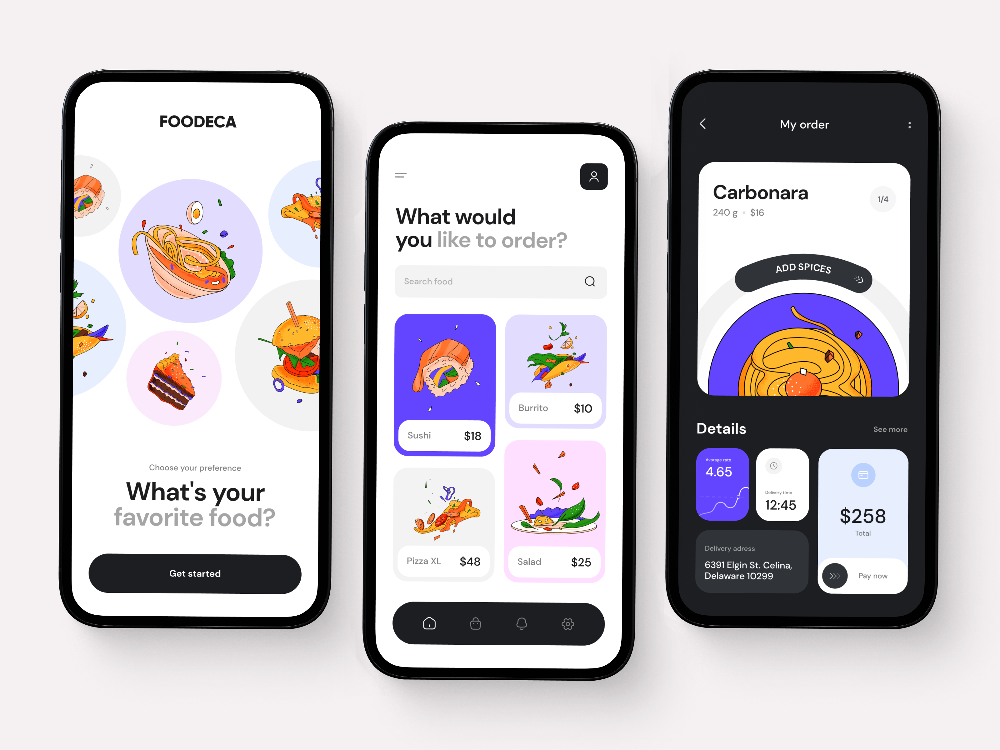
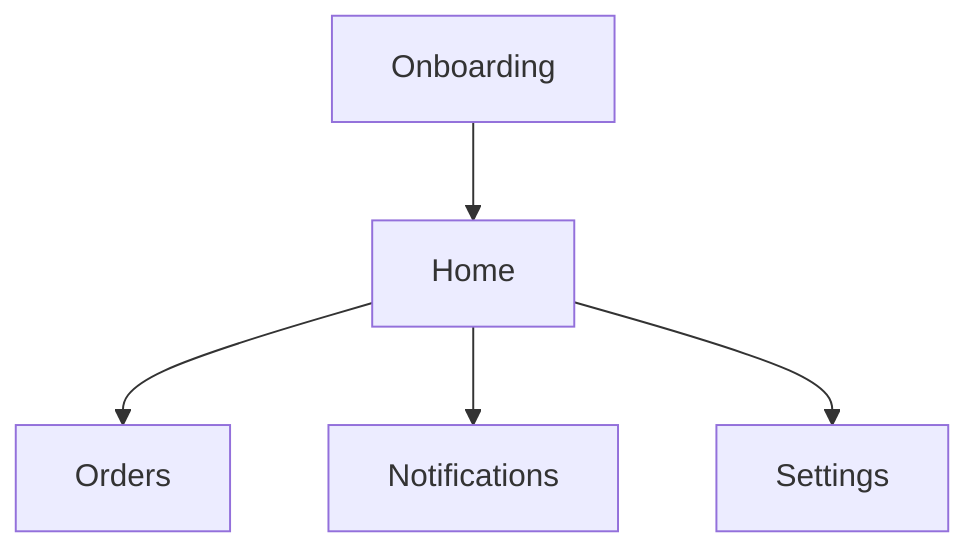

## Screens

- You can see 3 screens in below attached image
    1. Onboarding
    2. Home
    3. Orders

- Developers have to replicate any two.

- All the asstes needed to complete task can be found in assets directory.

## Instructions

- Developers have to use BLoC for state management
- Application should be responsive and performant
- Developers have to use reusable components
- Developers can integrate any package to use icons

### General Flow

